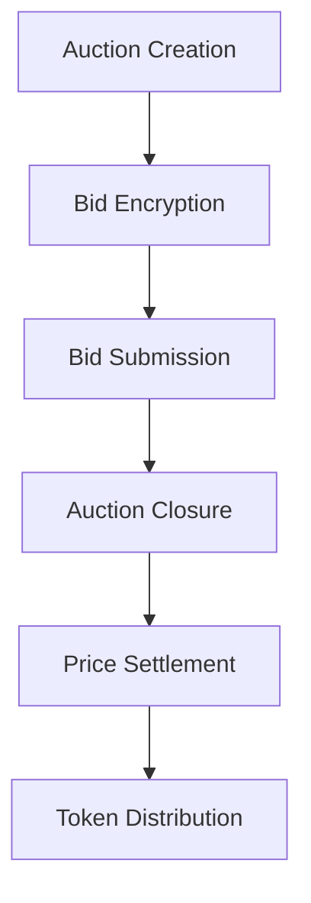

# 🏰 Confidential Single-Price Auction: Revolutionizing Token Sales with Privacy

<div align="center">
  
  
  
</div>

## 🌟 Project Vision: Redefining Auction Transparency and Privacy

### 💡 The Problem We Solve
Traditional auctions suffer from critical vulnerabilities:
- **Bid Sniping**: Last-minute bid manipulations
- **Price Transparency**: Revealing bidder strategies
- **Privacy Concerns**: Exposed bidder identities and intentions
- **Auction Resolution Issues**: Unclear handling of edge cases

### 🔒 Our Revolutionary Solution
We've developed a cutting-edge, confidential single-price auction system leveraging Zama's Fully Homomorphic Encryption Virtual Machine (fhEVM) to address these challenges.

## 🚀 Core Innovation: Encrypted Sealed Bidding

### How It Works
1. **Encrypted Submissions**:
   - Bids are fully encrypted
   - No one can see the actual bid values
   - Cryptographic guarantees of bid integrity

2. **Fair Price Discovery**:
   - Settlement price determined by the lowest bid to clear all tokens
   - Ensures market-driven, transparent pricing
   - Prevents manipulation and unfair advantages

## 🔍 Deep Dive: Technical Architecture

### 🛡️ Privacy Layers
- **Homomorphic Encryption**: Compute on encrypted data
- **Zero-Knowledge Proofs**: Validate bids without revealing contents
- **Secure Multiparty Computation**: Distributed bid processing

### 🧩 System Components
- **AuctionFactory.sol**: Dynamic auction creation
- **Auction.sol**: Core auction mechanics

## 📊 Auction Workflow



## 🎯 Key Features

### 🔒 Unparalleled Privacy
- **Encrypted Bids**: Complete bid confidentiality
- **Sealed Submission**: Prevent strategic bidding
- **Identity Protection**: Anonymous participation

### 🌈 Flexible Auction Design
- Support for ETH and ERC20 tokens
- Configurable auction parameters
- Adaptive settlement mechanisms

## 🤑 Addressing Key Challenges

### Challenge: Unsold Tokens or Insufficient Participation
- If an auction does not sell fully (e.g., no participant or insufficient bids), the developer can define resolution mechanisms such as:
  - **Refunding bidders** for unfulfilled allocations
  - **Executing at the lowest bid price** to distribute remaining tokens

### Challenge: Multiple Bidding Attempts
- **Enforced one-bid-per-user policy** via mapping and bid validation

### Challenge: Bid Modification Before Auction Ends
- **Prohibited bid modifications** to ensure fairness and prevent manipulation

### Challenge: Auction Duration
- Configurable with a minimum enforced duration of **1 hour** to balance efficiency and fairness

### Challenge: Handling Equal Lowest Bids
- In case of tie bids, the first submitted bid at the lowest price is prioritized

### Challenge: Preventing Fake Bids Without Funds
- **Locking mechanism** ensures funds are deposited before bid submission

## 🚀 Deployment Readiness

### Network Support
- **Sepolia Testnet**

### Quick Start

```bash
# Clone the repository
git clone https://github.com/itublockchain/FHE-single-price-auction.git

# Install dependencies
npm install

# Deploy to Sepolia
npx hardhat deploy --network sepolia
```

## 🌐 Future Roadmap

1. **Multi-Token Support**
2. **Advanced Auction Types**
3. **Cross-Chain Compatibility**
4. **Enhanced Privacy Protocols**

## 🏆 Zama Bounty Submission Highlights

- **Fully Encrypted Auction Mechanism**
- **Comprehensive Privacy Protection**
- **Innovative Use of fhEVM**
- **Scalable and Extensible Design**

## 📝 Compliance & Security

### Audit & Verification
- Detailed code comments
- Comprehensive documentation
- Ready for professional security audit

### Ethical Considerations
- Prioritize user privacy
- Transparent auction mechanics
- Fair participation guarantees

## 🤝 Community & Contributions

### We Welcome:
- Bug reports
- Feature suggestions
- Performance improvements
- Privacy enhancement proposals

### Contribution Guidelines
1. Fork the repository
2. Create a feature branch
3. Commit your changes
4. Push and create a Pull Request

## 💌 Contact & Support

- **Email**: [your-email@example.com]
- **Discord**: [Discord Invite Link]
- **Twitter**: [@YourProjectHandle]

---

**Disclaimer**: This is a research prototype. Extensive security review recommended for production use.

## 🌟 Special Thanks

- **Zama Team**: For the incredible fhEVM technology
- **Ethereum Community**: Continuous innovation inspiration
- **Privacy Advocates**: Driving the decentralization movement

<div align="center">
  
</div>

